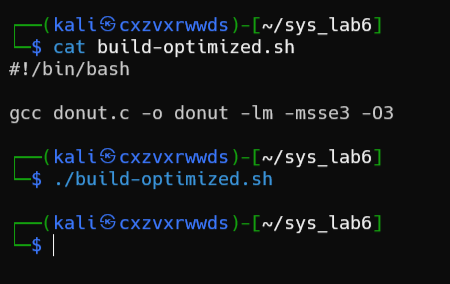

# Lab 6. Performance Measurement and Analysis. (+Assembler and low-level optimisation)


### Завдання 1.1 (+3 бали)
Продемонструвати процес побудови:


### Завдання 1.2 (+3 бали)

Пояснити (інтерпретувати) процес побудови:

**Flame Graph** - це тип візуалізації, який показує відносну кількість часу, витраченого на різні частини програми. Він корисний для розуміння продуктивності програми та ідентифікації областей для оптимізації. Flame Graph складається з горизонтальної стовпчастої діаграми з градієнтом червоно-помаранчевого кольору. Ось кілька ключових характеристик Flame Graph:

Вісь x представляє відносну кількість часу, витраченого на різні частини програми. Вісь y представляє глибину стеку виклику. Ширина кожного стовпчика відображає відносну кількість часу, витраченого на виконання певної функції. Написи на стовпчиках відображають імена функцій.

### Завдання 2.1 (+2 бали)
Команда «/usr/bin/time --verbose ./sort» використовується для вимірювання часу виконання програми. Вона виводить інформацію про ресурси, що використовуються програмою:


Command being timed: команда, яка була запущена.

User time (seconds): час, витрачений на виконання коду користувача.

System time (seconds): час, витрачений на виконання системного коду.

Percent of CPU this job got: відсоток CPU, виділений для виконання даної програми.

Elapsed (wall clock) time (h:mm:ss or m:ss): час, затрачений на виконання програми.

Average shared text size (kbytes): середній розмір спільного тексту.

Average unshared data size (kbytes): середній розмір неподілених даних.

Average stack size (kbytes): середній розмір стеку.

Average total size (kbytes): середній загальний розмір.

Maximum resident set size (kbytes): максимальний розмір набору резидентної пам'яті.

Average resident set size (kbytes): середній розмір набору резидентної пам'яті.

Major (requiring I/O) page faults: кількість мажорних помилок сторінки, які вимагають введення-виведення.

Minor (reclaiming a frame) page faults: кількість мінорних помилок сторінки, які відновлюють кадр.

Voluntary context switches: кількість добровільних перемикань контексту.

Involuntary context switches: кількість невільних перемикань контексту.

Swaps: кількість свопів.

File system inputs: кількість введень в файлову систему.

File system outputs: кількість виведень в файлову систему.

Socket messages sent: кількість відправлених повідомлень через сокет.

Socket messages received: кількість отриманих повідомлень через сокет.

Signals delivered: кількість доставлених сигналів.

Page size (bytes): розмір сторінки.

Exit status: статус завершення.

### Завдання 2.2 (+2 бали)
Команда perf stat -d ./sort використовується для відбору статистики профілювання процесу. Результати виводяться в форматі таблиці, де кожен рядок відповідає певному типу події профілювання, такому як кількість циклів, інструкцій, гілок, кеш-промахів тощо. Якщо певний тип події не підтримується апаратурою, то відображається повідомлення:


task-clock: час, витрачений на виконання програми.

context-switches: кількість перемикань контексту.

cpu-migrations: кількість міграцій процесора.

page-faults: кількість помилок сторінки.

cycles: кількість циклів процесора.

instructions: кількість інструкцій процесора.

branches: кількість гілок процесора.

branch-misses: кількість промахів гілок процесора.

L1-dcache-loads: кількість завантажень кеша першого рівня.

L1-dcache-load-misses: кількість промахів кеша першого рівня.

LLC-loads: кількість завантажень кеша останнього рівня.

LLC-load-misses: кількість промахів кеша останнього рівня.

Окрім того, результати вказують час, витрачений на виконання програми, час, витрачений на виконання користувацького коду та системного коду.

### Завдання 2.3 (+2 бали)

Результати команди perf report показують наступну інформацію:


Samples: кількість вибірок

Event count (approx.): приблизна кількість подій профілювання, пов'язаних з даною функцією.

Children: відсоток часу, витраченого на виконання даної функції.

Command: ім'я команди, яка була профільована.

Shared Object: ім'я спільного об'єкта, який був профільований.

Symbol: ім'я символу, який був профільований.

### Завдання 3.1 (+3 бали)
Встановимо утиліту powerstat, щоб заміряти енерговитрати:


Запустим нашу програму у 2-му вікні, та за допомогою ./powerstat.sh заміримо наші енерговитрати:


Дані містять наступні колонки:

Time: Час виконання команди. 

1. User: Відсоток часу, витраченого процесором на виконання користувацьких процесів. 

2. Nice: Відсоток часу, витраченого процесором на виконання процесів з низьким пріоритетом. 

3. Sys: Відсоток часу, витраченого процесором на виконання системних процесів. 

4. Idle: Відсоток часу, протягом якого процесор не виконував жодних процесів. 

5. IO: Відсоток часу, витраченого процесором на введення-виведення. 

6. Run: Кількість процесів, які були запущені за час виконання команди. 

7. Ctxt/s: Кількість змін контексту на секунду. 

8. IRQ/s: Кількість переривань на секунду. 

9. Fork: Кількість нових процесів, які були створені за час виконання команди. 

10. Exec: Кількість нових процесів, які були запущені за час виконання команди. 

11. Exit: Кількість процесів, які завершили свою роботу за час виконання команди. 

12. Watts: Середня потужність ватів, витрачена системою Kali Linux за час виконання команди.

### Завдання 3.2 (+3 бали)

Заміряти енерговитрати виключно досліджуваної програми:

Для цього вимкнемо нашу програму та знову запустимо powerstat:


Бачимо, що показники вказують на меньше навантаження, але в будь-якому випадку програма використовує дуже маленькі енерговитрати, на що вказує 0 Watts в результаті.

### Завдання 4.1 (+3 бали)

Для створення оптимізованого коду виконаємо наступний скрипт:



Цей скрипт компілює файл з оптимізацією 01.

Оптимізований код - це код, який був змінений з метою підвищення його продуктивності або ефективності. Оптимізація може бути виконана вручну або компілятором.

Оптимізація 01 GCC – це базова оптимізація, яка виконується компілятором GCC. Вона включає наступні зміни:

* Видалення змінних і функцій, що не використовуються.
* Оптимізація виразів.
* Оптимізація розгалуження.
* Оптимізація викликів функцій.

В результаті оптимізації 01 GCC код може стати більш швидким та ефективним. Однак у деяких випадках оптимізація може призвести до погіршення продуктивності або помилок.

Ось деякі конкретні відмінності між оптимізованим кодом та неоптимізованим кодом з оптимізацією 01 GCC:

* **Розмір:** Оптимізований код може бути меншим, ніж неоптимізований код, за рахунок видалення змінних і функцій, що не використовуються.
* **Час виконання:** Оптимізований код може виконуватися швидше, ніж неоптимізований код, за рахунок оптимізації виразів, розгалуження та викликів функцій.
* **Використання пам'яті:** Оптимізований код може використовувати менше пам'яті, ніж неоптимізований код, за рахунок видалення змінних і функцій, що не використовуються.
* **Точність:** У деяких випадках оптимізація може призвести до втрати точності.


### Завдання 4.2 (+3 бали)

time.sh після та до оптимізації:

Як ми бачимо, час на виконання програми зменшився разом з затратою ресурсів процесору.

perf-stat.sh після та до оптимізації:

Тут також бачимо зменшення часу після оптимізації.

### Завдання 4.3 (+3 бали)

До оптимізації:


Після оптимізації:


Після оптимізації, дуже малопомітно, але зменшився відсоток часу витраченного на оптимізовану програму.

### Завдання 4.4 (+3 бали)

До оптимізації:


Після оптимізації:


Як ми бачимо - результати після оптимізації більш продуктивніші та меньш енерговитратні.

### Requiments

```
git clone https://github.com/brendangregg/FlameGraph
apt install time
apt install perf
apt install powerstat
``````